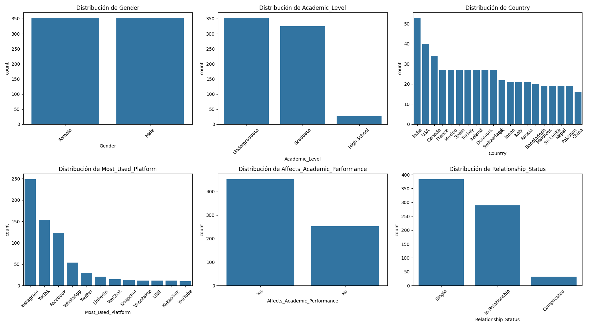
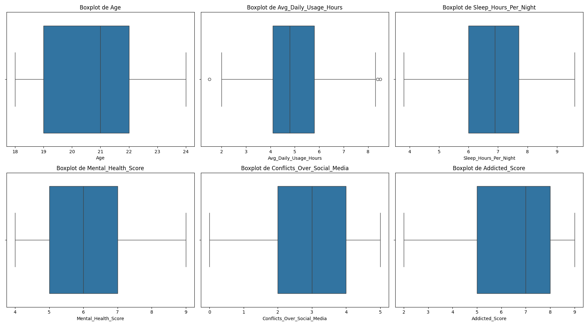
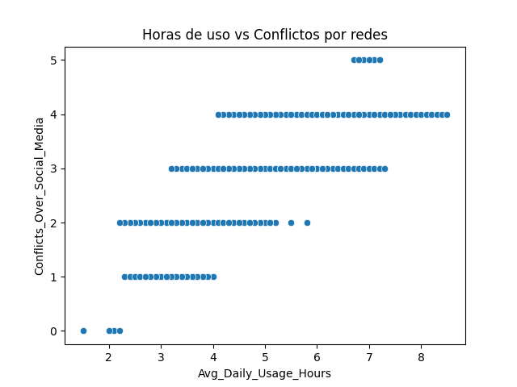
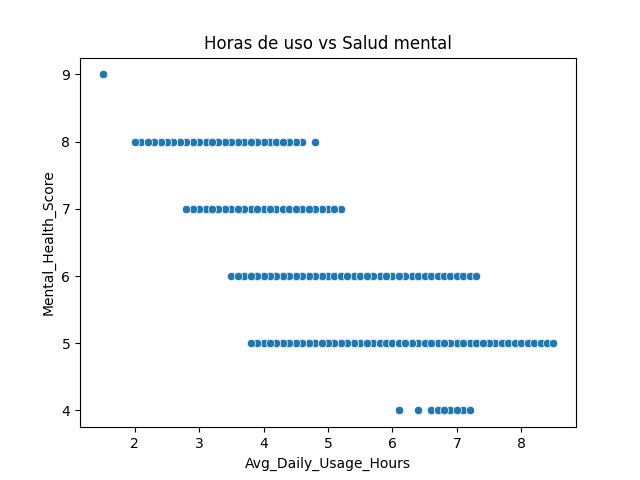
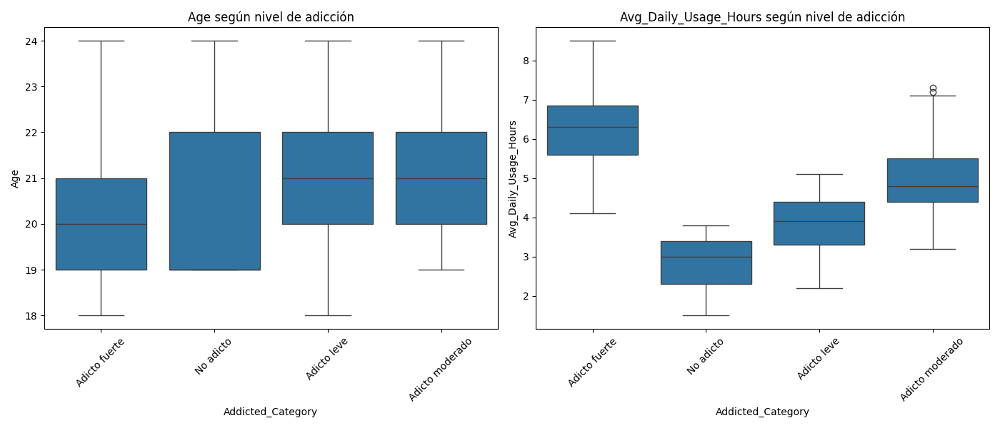
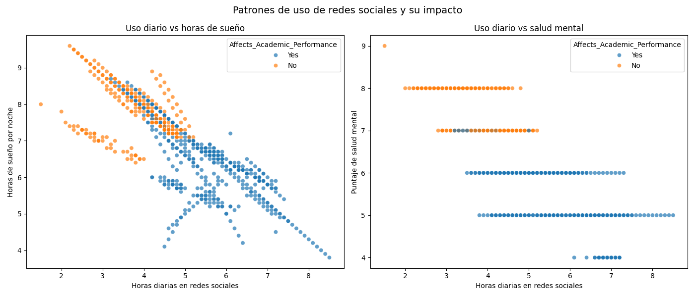

# Social Media Addiction Analysis

## Exploring the impact of social media use on students' emotional, social and academic wellbeing

This project analyzes how social media habits influence students' mental health, relationships, sleep quality and academic performance.  
Using the **Students’ Social Media Addiction vs Relationships** dataset from Kaggle, the analysis identifies patterns, tests hypotheses and builds predictive models for addiction levels and academic impact.

The goal is to offer insights for educators, students and anyone interested in understanding how social media usage affects daily life.

---

## Dataset

- **Source:** Kaggle – Students’ Social Media Addiction vs Relationships  
- Included in the repository under `/data` for full reproducibility  
- The notebook loads the CSV directly without requiring manual downloads  
- Variables include:  
  - Daily hours on social media  
  - Gender and age  
  - Sleep hours  
  - Mental health  
  - Relationship conflicts  
  - Academic impact  
  - Self-reported addiction levels  

---

## Objectives

- Identify social media usage patterns by hours per day, age, gender and country  
- Analyze the impact on relationships, sleep, mental health and academic performance  
- Validate hypotheses about dependency and related effects  
- Classify addiction levels using machine learning  
- Detect subgroups of students with similar behaviors  

---

## Tech Stack

- Python  
- Pandas, NumPy  
- Matplotlib, Seaborn  
- Scikit-learn  
- Google Colab  

---

## Repository Structure
```
/data
Students Social Media Addiction.csv

/notebooks
Social_Media_Addiction.ipynb

/presentation
Análisis de adicción a las redes sociales.pdf

requirements.txt
```
---

## Key Findings

- Students using social media **more than 6 hours per day** show higher levels of interpersonal conflict, worse mental health and fewer hours of sleep.  
- **Daily usage time** is the strongest factor explaining addiction: after **4 hours/day**, dependency levels increase sharply.  
- **Age and gender** have very little influence on addiction; the main pattern is driven almost entirely by usage hours.  
- From **5–6 hours/day** onward, the probability of academic impact becomes very high, approaching **100%** for heavy users.  
- Two clear student groups were identified:  
  - **Unaffected group:** lower usage, more sleep, better mental health  
  - **Affected group:** higher usage, less sleep, worse mental health, more conflicts  
- The variables form a consistent cycle:  
  **more hours online → less sleep → worse mental health → more conflicts → stronger academic impact**

---

## Key Figures

Here are the main visualizations from the social media addiction analysis:

### Categorical Distributions


### Numerical Distributions (Boxplots)


### Correlation Heatmap


### Usage vs Conflicts / Mental Health



### Age & Usage vs Addiction Level


### Academic Impact


### Pairplots



### Multivariate / Subgroup Analysis


> Full analysis and additional charts are available in the notebook under `/notebooks/Social_Media_Addiction_Analysis.ipynb`.

---

## How to Reproduce

1. Clone or download the repository  
2. Install dependencies:
```
pip install -r requirements.txt
```
3. Run the analysis notebook:
```
/notebooks/Social_Media_Addiction.ipynb
```
